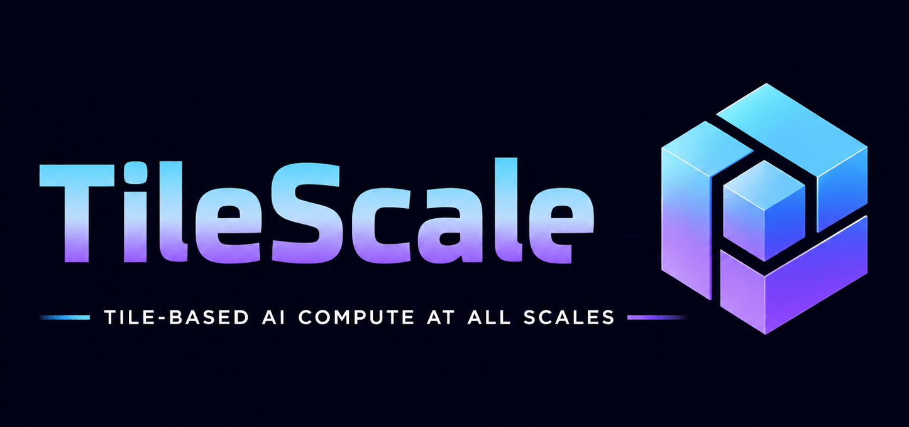

# TileScale: Fine-grained Distributed GPU Programming with TileLang

<div align="center">
  
</div>

TileScale extends [TileLang](https://github.com/tile-ai/tilelang) with
fine-grained, kernel-side communication for distributed accelerators. The
current implementation keeps TileLang's Python kernel language, compiler, JIT,
and cache interfaces, and adds an experimental single-host, multi-GPU CUDA
runtime.

The current release candidate is based on upstream TileLang commit
[`550e25d493a93729cb087e4ecb587c19028d3cea`](https://github.com/tile-ai/tilelang/commit/550e25d493a93729cb087e4ecb587c19028d3cea).
TileScale's distributed additions are designed to remain opt-in: ordinary
TileLang programs continue through the upstream-compatible compiler paths,
while distributed kernel support is injected only when its primitives are
used.

## What Works Today

| Area | Current status |
|------|----------------|
| Execution model | One host, one process per local GPU, with contiguous rank-to-device mapping |
| Host coordination | PyTorch distributed with an NCCL process group |
| Peer memory | CUDA IPC, or CUDA VMM fabric handles when the runtime capability probe succeeds |
| Kernel operations | Peer load, store, copy, TMA, signal, wait, atomic, and barrier primitives |
| Optional fabric operations | Multicast allocation and multimem operations on compatible NVSwitch/IMEX systems |
| Compilation | Normal TileLang lowering plus coordinated `compile_once` support for multi-process JIT |
| Kernel examples | All-gather GEMM, GEMM all-reduce, reduce-scatter, and multimem variants |

The distributed extension currently targets NVIDIA CUDA only. Multi-node
execution, non-contiguous device subgroups, NVSHMEM, DeepEP, and a general
distributed runtime are not currently supported.

## How It Works

TileScale separates host-side coordination from the kernel data path:

```text
one process per GPU
        |
NCCL process group (launch, barriers, and handle exchange)
        |
BaseAllocator: local allocation -> peer handle exchange -> peer VA mappings
        |
symmetric bump allocations + rank/base-address metadata table
        |
kernel.initialize(allocator)
        |
TileLang lowering -> direct peer CUDA operations / optional multimem
```

1. `init_dist` binds each process to its local CUDA device and creates the NCCL
   process group. NCCL provides the control plane; generated kernels do not use
   NCCL as their peer-memory data path.
2. A distributed `BaseAllocator` reserves one contiguous region per rank,
   exchanges CUDA IPC or VMM handles, and maps every peer into the local virtual
   address space.
3. Each rank performs allocator-backed allocations in the same order and with
   the same sizes. A remote pointer is computed from the local allocation
   offset and the selected peer's base address.
4. `kernel.initialize(allocator)` installs rank, world-size, and peer base
   addresses into the generated module. Rank queries, pointer remapping, and
   remote TMA operations use that metadata at runtime.
5. The kernel issues direct CUDA peer-memory instructions. On supported
   systems, multicast mappings also enable hardware multimem operations.

`compile_once=True` coordinates which rank populates a shared TileLang disk
cache first. It does not broadcast a compiled binary, and an unavailable cache
can still require compilation on other ranks.

## Programming Surface

Distributed operations use the existing `tilelang.language` namespace. This
small kernel copies each block to the other rank:

```python
import tilelang.language as T


@T.prim_func
def remote_copy(dst: T.Tensor((1024,), "float32"),
                src: T.Tensor((1024,), "float32")):
    with T.Kernel(8, threads=128) as block:
        rank = T.alloc_local((1,), "uint64")
        rank[0] = T.get_rank()
        T.put_block(
            src=T.address_of(src[block * 128]),
            dst=T.address_of(dst[block * 128]),
            size=128,
            dst_pe=rank[0] ^ 1,
        )
```

The host follows a collective lifecycle:

```python
rank, world_size, group = init_dist(local_rank, num_local_ranks)
allocator = tilelang.get_allocator(
    size=2**30,
    device="cuda",
    is_distributed=True,
    local_rank=local_rank,
    num_local_ranks=world_size,
    group=group,
)

kernel = tilelang.compile(remote_copy, compile_once=True, compile_group=group)
kernel.initialize(allocator=allocator)

src = tilelang.tensor((1024,), torch.float32, allocator=allocator)
dst = tilelang.tensor((1024,), torch.float32, allocator=allocator)
kernel(dst, src)

allocator.close()                 # collective across participating ranks
torch.distributed.destroy_process_group()
```

Allocator-backed tensors are zero-copy PyTorch tensors over the mapped region.
They must not outlive their allocator. All ranks must close the allocator
collectively before destroying the process group. See the executable
[remote-copy test](testing/python/distributed/primitives/comm/test_remote_copy.py)
and the [distributed API reference](docs/distributed_api_reference.md) for the
complete contract.

## Capability and Validation Status

The memory path is selected according to runtime capabilities:

| Path | Current status | Requirements |
|------|----------------|--------------|
| CUDA IPC | Implemented and validated | Same host and peer access between all participating GPUs |
| VMM fabric | Implemented, auto-detected, and validated on the release host | CUDA driver API 12.4+, fabric-handle support on every visible GPU, and an accessible NVIDIA IMEX channel |
| Multicast and multimem | Implemented, experimental, capability-gated, and validated on the release host | VMM requirements plus multicast-capable GPUs and fabric, normally NVSwitch |

The 2026-07-26 release candidate was evaluated on an 8 x NVIDIA B200 NVSwitch
host with CUDA 13.2. Validation covered both allocator paths. Before IMEX was
configured, the forced-IPC distributed suite completed with 97 tests passing
and 5 fabric-dependent capability skips. After an administrator exposed an
IMEX channel, the 2026-07-27 follow-up automatically selected VMM and completed
with 103 tests passing, including VMM, multicast, and multimem cases.

Four post-configuration 8-GPU test nodes also passed on every rank: specialized
all-gather GEMM, specialized GEMM all-reduce, multimem one-shot/two-shot
all-reduce, and the experimental ordinary-TMA store to multicast VA. Separate
broad upstream-compatibility slices passed on the same candidate. Focused
forced-VMM runs also exercised native multimem TMA broadcast and reduction on
B200 (SM100) and checked every participating GPU's physical multicast backing.
These instructions require SM90+ and CUDA 13.1+. Exact environment details,
test records, and the two-stage validation timeline are in the
[release validation report](docs/release_v0_0726.md).

## Installation

Python 3.10 or newer is required. Building for Blackwell/B200 requires CUDA
12.8 or newer; CUDA 13.x is recommended for the distributed B200 examples.

Install from a source checkout with pinned submodules:

```bash
git clone --recursive https://github.com/tile-ai/tilescale.git
cd tilescale
python -m pip install -r requirements-dev.txt
python -m pip install --no-build-isolation ".[distributed]"
```

Editable installs are not supported by the current build. Developers can build
the native library and use the source tree directly:

```bash
cmake -S . -B build -DUSE_CUDA=ON -DCMAKE_BUILD_TYPE=Release
cmake --build build -j
export PYTHONPATH="$PWD${PYTHONPATH:+:$PYTHONPATH}"
```

The Python distribution is named `tilescale`, but it intentionally provides
the `tilelang` import namespace as a TileLang fork/replacement. Do not install
upstream `tilelang` and `tilescale` in the same environment.

See the [installation guide](docs/get_started/Installation.md) for wheel,
toolchain, Docker, and migration details.

## Running and Testing

Select the exact local GPU set before launching. Capability probes inspect all
CUDA-visible devices. This command runs the maintained four-GPU CUDA IPC path:

```bash
CUDA_VISIBLE_DEVICES=0,1,2,3 TILESCALE_USE_VMM=0 \
python examples/distributed/allgather_gemm/example_allgather_gemm_overlapped.py \
  --num-processes 4
```

Run the upstream-compatible test set and the distributed suite from the
repository root:

```bash
python -m pytest -m "not perf and not slow" testing/python
CUDA_VISIBLE_DEVICES=0,1,2,3 python -m pytest testing/python/distributed
```

With no override, a distributed allocator uses VMM only when the fabric probe
succeeds and otherwise falls back to CUDA IPC. Diagnostic overrides are:

```bash
export TILESCALE_USE_VMM=0  # force CUDA IPC
export TILESCALE_USE_VMM=1  # force VMM; failure does not fall back to IPC
```

VMM fabric and multicast require an IMEX channel readable by the process. On a
compatible host, an administrator can configure a user-scoped channel with
`tilelang/distributed/scripts/conf_vmm.sh`. The script requires `sudo` and does
not make unsupported hardware fabric-capable.

## Long-term Vision

The current implementation is a pragmatic foundation: it exposes fine-grained
communication inside TileLang kernels so local computation can overlap with
single-host peer data movement. TileScale's longer-term goal is a tile-oriented
programming and compiler stack for distributed AI systems, spanning tightly
connected accelerators, multi-node deployments, and emerging distributed
accelerator designs.

Large model execution already crosses GPU and node boundaries. At the same
time, chiplets, 3D integration, near-memory computing, and wafer-scale systems
are making individual accelerators internally distributed. These systems have
different names and link technologies, but they share the same core problem:
computation, data placement, communication, and synchronization must be
scheduled together across a non-uniform hierarchy.

### Hierarchical Distributed Architecture

TileScale uses a Hierarchical Distributed Architecture (HDA) as its conceptual
machine model. HDA organizes three kinds of resources at every hardware level:

- **Compute:** processing units that execute tile operations, from threads and
  warps through CTA clusters, dies, devices, and nodes.
- **Memory:** register, local, shared, peer, and distributed storage, with
  locality and ownership represented explicitly rather than hidden.
- **Network:** on-chip fabrics, device interconnects, and host or cluster links,
  together with their communication and synchronization mechanisms.

The hierarchy is defined by the target architecture rather than a fixed list
of GPU-specific levels. Units at one level form a larger unit at the next;
memory may be private, shared, or distributed across those units; and peer
units may communicate over hardware or software-defined channels. The desired
user model is a coherent distributed device, while the compiler continues to
respect real topology, bandwidth, latency, and synchronization boundaries.

HDA is a design direction, not a claim that the current release virtualizes a
whole cluster or arbitrary accelerator. Today, TileScale implements the local
multi-GPU portion of that hierarchy. Future backends can extend the same model
without changing the basic tile-oriented programming style.

### Tile-oriented Programming Model

The fundamental programming unit remains a tensor tile. TileScale plans a
consistent family of tile operations across hardware levels:

- **Compute primitives** transform input tiles into output tiles and can lower
  to specialized implementations at different execution scopes.
- **Memory primitives** allocate, move, and stage tiles across local, shared,
  peer, and distributed memory layers.
- **Communication primitives** transfer tiles between peers and express
  point-to-point operations, collectives, signals, and barriers.

One logical operation may have multiple implementations. A local copy might
use an LSU or TMA; a peer copy might use direct load/store, TMA, or a copy
engine; a collective might use peer memory, multicast, or a transport library.
The compiler should select and compose implementations using dtype, shape,
layout, topology, runtime capability, and overlap opportunities instead of
forcing every kernel author to encode those decisions manually.

`T.Scale` is the planned scope abstraction for mapping a region of a program to
a level in the hardware hierarchy. It is intended to expose the rank and size
of that scope, support SPMD execution and task specialization, and allow nested
device, cluster, warpgroup, or warp-level work. An illustrative future form is:

```python
# Illustrative future syntax; not part of the current stable API.
with T.Scale("device") as rank, world_size:
    T.copy(local_tile, peer_tile, dst=(rank + 1) % world_size)
    T.barrier()
```

The same structure can describe device-level tensor parallel work, CTA-cluster
cooperation, warpgroup specialization, or software channels between units that
lack a direct hardware link. Nested scopes give the compiler a place to reason
about placement, ownership, synchronization, and cross-level overlap as one
program rather than disconnected kernels and host collectives.

### Compiler and Runtime Roadmap

The long-term system is organized around five cooperating layers:

1. A Python frontend for tile computation, memory movement, communication, and
   hierarchical execution scopes.
2. A compiler and intermediate representation that lower high-level tile
   operations, infer legal placement, and schedule compute and communication.
3. A tile-kernel library containing tuned implementations for common local and
   distributed primitives.
4. A performance model and autotuner that compare implementations using target
   topology, measured costs, and resource constraints.
5. Configurable backends and runtimes that describe the hardware hierarchy,
   provide transport and allocation mechanisms, and report capabilities.

Near-term work focuses on hardening the current single-host runtime, expanding
distributed kernel libraries, and making topology and capability information
available to lowering and tuning. Later stages include multi-node execution,
portable transports, compiler-managed data placement, automatic overlap of
compute with memory movement and collectives, and backends for heterogeneous or
next-generation distributed accelerators.

The aim is to make locality, topology, communication, and synchronization
first-class compiler concerns while preserving the direct, composable kernel
programming style that makes TileLang useful.

## Project Status and Contributing

TileScale is experimental. API details, capability gates, and performance
behavior may change as the runtime is hardened. Contributions should include
tests for the normal TileLang path as well as any distributed path they touch.
Please use GitHub issues for design discussions and bug reports.

Useful entry points:

- [Distributed API reference](docs/distributed_api_reference.md)
- [Distributed examples](examples/distributed)
- [Distributed tests](testing/python/distributed)
- [Release validation report](docs/release_v0_0726.md)

## License

TileScale is distributed under the terms in [LICENSE](LICENSE). Bundled and
derived components are covered by their respective terms; see
[THIRDPARTYNOTICES.txt](THIRDPARTYNOTICES.txt) and [LICENSES](LICENSES).
